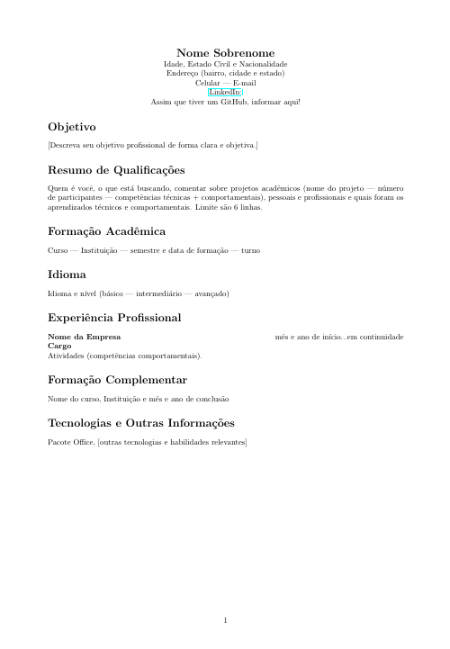

# CV-Latex

This project is a LaTeX template for creating professional CVs in an elegant and efficient way.

## Project Structure

- `CV-Model.tex`: is a recruiter-corrected version of a CV template.
    

- `CV-Model - english.tex`: is another version with lines for separation and color.

## How to use

1. Clone the repository to your computer:
    ```bash
    git clone https://github.com/seu-usuario/CV-Latex.git
    ```
2. Navigate to the project directory:
    ```bash
    cd CV-Latex
    ```
3. Edit the file `CV-Model.tex` and the files in the sections as necessary.
4. Compile the document using the `pdflatex` command:
    ```bash
    pdflatex CV-Model.tex
    ```

## Requirements

- [LaTeX](https://www.latex-project.org/get/) installed on your system.
- Text editor of your choice (we recommend [TeXstudio](https://www.texstudio.org/)).

## Contribution

Contributions are welcome! Feel free to open issues and pull requests for improvements and corrections.